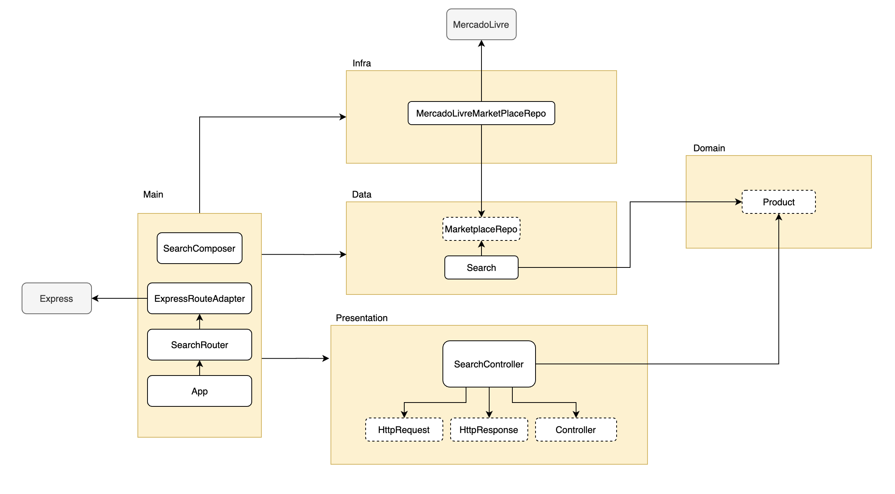

# mercadolivre-crawler
An API that retrieves data from Mercado Livre's website


## Introduction

This API is intended to retrieve product data from Mercado Livre and return an array containing the results.

## Folder Architecture

The folder architecture was done following the patterns described in [Uncle Bob's Clean Architecture](https://blog.cleancoder.com/uncle-bob/2012/08/13/the-clean-architecture.html). There are five layers that each concern about a single part of the code: Main, Presentation, Domain, Infra, Data. This architecture was chosen to make the components more decoupled, provide interfaces to communicate with each other and make sure that the project is easily extensible. For instance, if another marketplace is now the source of the data, I only need to make sure that the infra layer that contains the new repository implements the same methods as the interface created. Thus, changing the dependency that I'm injecting inside my business logic and making sure that I don't need to touch it.

### Main Layer
The Main layer is responsible for building the project, just like a couple of LEGO bricks. These bricks are responsible to mount together the external libraries necessary for the project to run and the how the infra, data and presentation layer inject dependencies into one another. If the Main layer inject a dependency inside the Data layer, this dependency must implement all the methods that the interface is expecting to receive, and so on. In this layer, I initialize the app, configure logging, routing, and the Express Adapter to communicate with Express.

### Presentation Layer
This layer is responsible to make the communication between the Data layer and the results that the Main layer will receive. In this layer, I implemented the controller that receives the HTTP request, validates it and calls the Use Case from the Data layer to apply the business logic.

### Data Layer
Here, I implemented all the business logic responsible to call the Marketplace Repository, retrieve the results and return to the presentation layer.

### Domain layer
The Domain layer contains all the models and the Entities that are being used by the application.

### Infra Layer
Lastly, the Infra layer contains the repositories that are responsible to communicate with Mercado Livre's website, parse the data and return to the Data layer.



## TDD

The project was built using TDD and making sure that each passing test results in a commit to the repository. Therefore, I have total control of everything that each feature or refactoring is actually covered by tests which gives me confidence to change things as I please.

## Missing tasks

- Ensure that the API goes through more pages in case the limit given is greater than the pagination of Mercado Livre's search page.
- Dockerize the application to make sure everything can be deployed easier
- Setup CI/CD with circleCI (free account)

## Setup

Make sure you have at least node v12 installed and run `yarn install` in the root folder.

To run the api:
  ```yarn build && yarn start```

To run tests:
  ```yarn test```

To run unit tests and watch while developing:
  ```yarn run test:unit```

To run integration tests:
  ```yarn run test:integraiton```

To run with coverage:
  ```yarn run test:ci```

## Improvements

The chosen approach needs to wait for each response of Mercado Livre's pages to parse and return the results. The main disavantage about this approach is that the api is limited by the response of each product page, which can be very slow. Another disavantage would be that, in general, crawlers are susceptible of errors if the page changes its content. A single CSS class change could break the entire code.There are a few alternatives that can be done to improve the response time and the reliability of the code:

- Save search results in a local database and make sure that there's an expiration time to know when the search should be made in Mercado Livre's website again
- Check if the website has an API to be used instead of using a crawler
- Create a crawler that will fetch all products from the website

## Dependencies

The API framework used was Express. This was because express is simple to use, provides middlewares for customization and steps definition, and it's very well supported by a huge community. All three factors were considered to ensure that the API could be maintained for a longer time.

To retrieve information from the website, Axios was used in combination with Cheerio. The first fetches the response of the urls and the latter works as a jquery tool on the html responded by Axios. Therefore, I can fetch the results of the API and navigate through the HTML with the CSS definitions.

### Production
  - axios
  - cheerio
  - express

### Development
  - @types/jest
  - @types/node
  - @types/supertest
  - @typescript-eslint/eslint-plugin
  - copyfiles
  - eslint
  - eslint-config-standard-with-typescript
  - eslint-plugin-import
  - eslint-plugin-node
  - eslint-plugin-promise
  - eslint-plugin-standard
  - faker
  - git-commit-msg-linter
  - husky
  - jest
  - lint-staged
  - nock
  - rimraf
  - supertest
  - ts-jest
  - typescript
